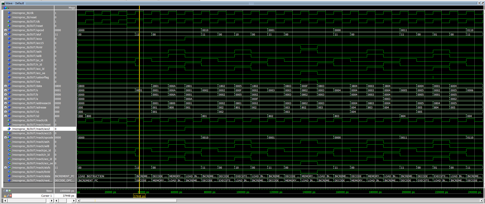
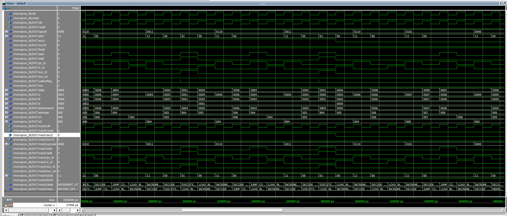
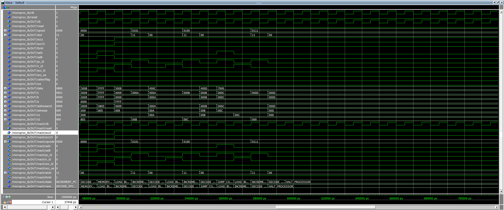
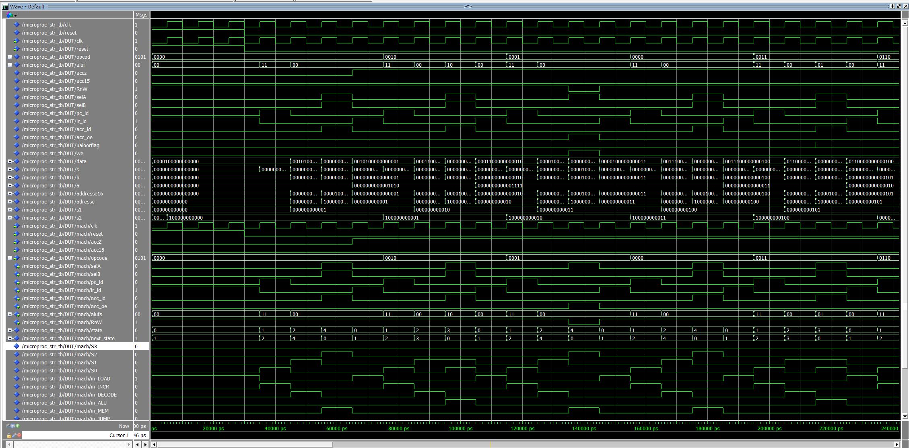
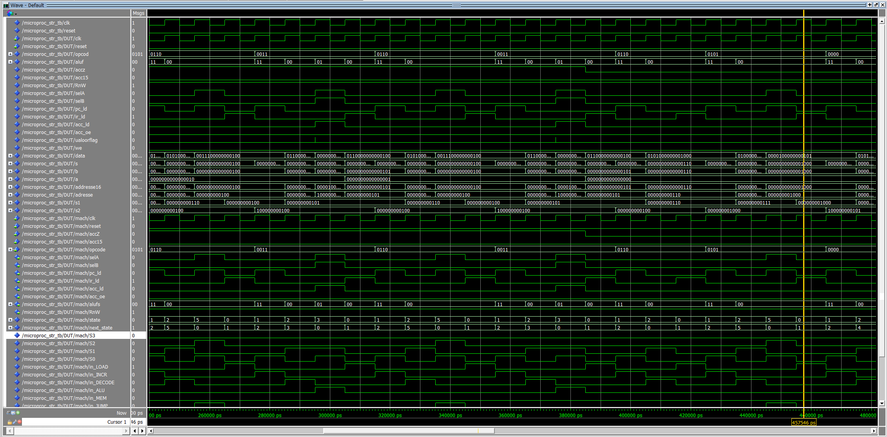
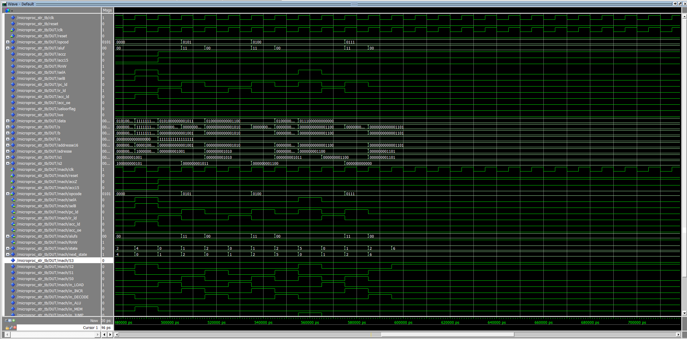
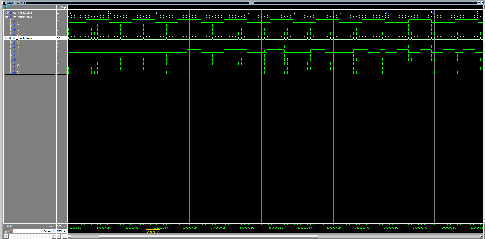
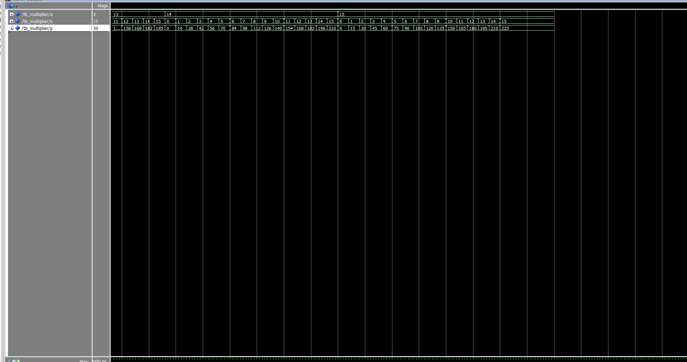

# 16-bit VHDL Microprocessor — Xilinx FPGA

A fully functional, custom-designed 16-bit microprocessor implemented entirely in VHDL, synthesized and deployed on a **Xilinx FPGA board**. Built from first principles as an academic project at ENICarthage (Infotronics Engineering, Tunisia).

The project includes **two complete implementations** of the control unit — one behavioral and one structural — along with a standalone concurrent hardware multiplier, each fully simulated and verified.

---

## Project Structure

```
microproc/
├── microproc_behavioral.vhd        # All datapath components + behavioral FSM + top-level microproc
├── fsm_structural.vhd              # Structural FSM — pure boolean equations, no enumerated states
├── microproc_structural.vhd        # Top-level microproc_str wiring structural FSM to shared datapath
├── tb_behavioral.vhd               # Testbench — behavioral design
├── tb_structural.vhd               # Testbench — structural design
├── wave_behavioral.do              # ModelSim wave script — behavioral
├── wave_structural.do              # ModelSim wave script — structural (includes state encoding legend)
├── simulation_transcript.txt       # Full behavioral simulation transcript
├── behavioral_waveform_0ns_240ns.png
├── behavioral_waveform_240ns_480ns.png
├── behavioral_waveform_480ns_720ns.png
├── structural_waveform_0ns_240ns.png
├── structural_waveform_240ns_480ns.png
├── structural_waveform_480ns_720ns.png
└── multiplier/
    ├── multiplier.vhd              # Concurrent 4×4-bit hardware multiplier
    ├── tb_multiplier.vhd           # Testbench — all 256 input combinations with assertions
    ├── multiplier_waveform_full.png
    ├── multiplier_waveform_zoom.png
    └── multiplier_waveform_detail.png
```

---

## Architecture Overview

The processor follows a classic **accumulator-based von Neumann architecture**. All instructions operate through a single accumulator register (ACC), with operands fetched from a 4096-word asynchronous RAM.

### Full Datapath

```
         ┌─────────────┐
         │  Async RAM  │ ← 4096 × 16-bit (64KB), R/W, asynchronous
         │  (pre-init) │
         └──────┬──────┘
                │ data bus (16-bit, bidirectional inout)
         ┌──────▼──────┐        ┌────────────┐
         │     IR      │        │     PC     │ ← 12-bit program counter
         │ (Instr Reg) │        │  (clocked) │
         └──────┬──────┘        └──────┬─────┘
          opcode│  addr(11:0)          │ addr(11:0)
                │              ┌───────▼──────┐
                │              │  MUX_12to1   │ ← selA: PC addr vs IR addr
                │              └───────┬──────┘
                │                      │ → RAM address bus
                │
         ┌──────▼──────┐
         │  MUX_16to1  │ ← selB: immediate (zero-extended IR addr) vs RAM data
         └──────┬──────┘
                │ B input
         ┌──────▼──────┐        ┌────────────┐
         │     UAL     │◄───────│    ACC     │ ← Accumulator (A input)
         │    (ALU)    │        │  (clocked) │
         └──────┬──────┘        └────────────┘
                │ ALU result
                └─→ ACC input / PC input / RAM data bus (via buffer1)
         ┌─────────────┐
         │   buffer1   │ ← acc_oe: drives ACC onto RAM data bus for STO
         └─────────────┘
```

The schematic below shows the complete datapath with all bus widths and control signals:


---

## Component Breakdown

### `Async_RAM` — Asynchronous Read/Write Memory
- **4,096 addresses × 16 bits**, fully asynchronous (no clock)
- Bidirectional `data` bus (`inout`): drives RAM data when `we='0'`, receives data when `we='1'`, high-Z otherwise
- Pre-initialized with a 14-instruction verification program and data operands

### `PC` — Program Counter
- 12-bit clocked register, loads new address on rising edge when `pc_ld='1'`
- Connected to the RAM address bus via MUX_12to1 during instruction fetch

### `IR` — Instruction Register
- 16-bit clocked register, splits each fetched instruction into:
  - `opcode[15:12]` — upper 4 bits → FSM controller
  - `operand[11:0]` — lower 12 bits → operand/jump address → MUX_12to1

### `ACC` — Accumulator
- 16-bit clocked register, sole working register of the processor
- Drives two status flags to the FSM:
  - `accZ` — `'1'` when ACC ≠ 0 (used by JNE)
  - `acc15` — MSB of ACC, i.e. sign bit (used by JGE)

### `UAL` — ALU
- 16-bit ALU, 2-bit function select:

| `alufs` | Operation | Used by |
|---------|-----------|---------|
| `"00"` | Pass B | LDA |
| `"11"` | B + 1 | PC increment |
| `"10"` | A + B | ADD |
| `"01"` | A − B | SUB |

- Built from generic N-bit `adder` and `subber`, each a ripple-carry chain of `Full_Adder` / `Full_Subber` instances


### `MUX_12to1` / `MUX_16to1` / `buffer1`
- **MUX_12to1** (`selA`): selects RAM address — PC output (`'0'`) or IR operand (`'1'`)
- **MUX_16to1** (`selB`): selects ALU B-input — zero-extended IR addr (`'0'`) or RAM data (`'1'`)
- **buffer1**: tri-state buffer — drives ACC onto the data bus during STO, high-Z otherwise

---

## Instruction Set

Each instruction is **16 bits wide**, split into a 4-bit opcode and a 12-bit operand address:


| Opcode | Mnemonic | Operation |
|--------|----------|-----------|
| `0000` | **LDA** | ACC ← RAM[addr] |
| `0001` | **STO** | RAM[addr] ← ACC |
| `0010` | **ADD** | ACC ← ACC + RAM[addr] |
| `0011` | **SUB** | ACC ← ACC − RAM[addr] |
| `0100` | **JMP** | PC ← addr (unconditional) |
| `0101` | **JGE** | PC ← addr if ACC ≥ 0 (sign bit = 0) |
| `0110` | **JNE** | PC ← addr if ACC ≠ 0 |
| `0111` | **STP** | Halt processor |


### Pre-loaded Verification Program

The RAM is pre-initialized with a 14-instruction program that exercises every instruction and both outcomes of every branch:

```
Addr  Mnemonic       Effect
────  ─────────────  ──────────────────────────────────────────
 0    LDA 14         ACC = 10
 1    ADD 15         ACC = 15  (10 + 5)
 2    STO 16         RAM[16] = 15
 3    LDA 17         ACC = 3   (load loop counter)
 4    SUB 18         ACC = ACC − 1          ◄─┐ countdown loop
 5    JNE 4          jump to 4 if ACC ≠ 0   ──┘ (taken 3×, then falls through)
 6    JGE 8          ACC=0 ≥ 0 → taken, jump to 8
 7    JMP 11         skipped
 8    LDA 19         ACC = 0xFFFF  (−1 in two's complement)
 9    JGE 11         ACC < 0 → not taken, fall through
10    JMP 12         jump to correct halt
11    JMP 13         wrong-path indicator (unreachable on correct execution)
12    STP            correct halt  ✓
13    STP            wrong-path halt (reachable only if branch logic is broken)

Data section (immediately after instructions — all within 64-word address space):
  RAM[14] = 10    RAM[15] = 5     RAM[16] = 0 (result slot)
  RAM[17] = 3     RAM[18] = 1     RAM[19] = 0xFFFF
```

Correct execution always terminates at address 12. Termination at address 13 indicates a branch logic fault.

---

## FSM Control Unit — Two Implementations

### 1. Behavioral FSM (`machine_etat`)
Uses VHDL enumerated state types and `case` statements:

```
LOAD_INSTRUCTION → INCREMENT_PC → DECODE_OPCODE
    → EXECUTE_ALU_OPERATION   (ADD, SUB)
    → MEMORY_ACCESS           (LDA, STO)
    → JUMP_CONDITIONAL        (JMP, JGE, JNE)
    → HALT_PROCESSOR          (STP — self-loop)
    → LOAD_INSTRUCTION
```

### 2. Structural FSM (`machine_etat_structurelle`)
Implements the identical state machine using only minimized boolean logic equations — no `case` statements, no enumerated types. State is a raw 4-bit vector; all transitions and outputs are direct combinational logic derived from the state transition truth table.

| Hex | State | Description |
|-----|-------|-------------|
| `0` | LOAD | Fetch instruction into IR |
| `1` | INCR | Increment PC |
| `2` | DECODE | Decode opcode, evaluate branch condition |
| `3` | ALU_EXEC | Execute ADD or SUB |
| `4` | MEM | LDA (RAM → ACC) or STO (ACC → RAM) |
| `5` | JUMP | Load branch target into PC |
| `6` | HALT | STP reached — self-loop |

This approach mirrors what synthesis tools produce internally and demonstrates gate-level FSM design — equivalent to manually deriving logic from a Karnaugh map.

---

## Simulation Results

### Behavioral





### Structural





### Multiplier




---

## FPGA Synthesis

Synthesized using **Quartus Prime Pro 26.1.0** targeting the **Cyclone 10 GX (10CX085YF672E5G)**.

### Adaptations for FPGA

The design was originally written for behavioral simulation using an asynchronous RAM model — standard academic/ASIC practice. Three targeted changes were made for FPGA synthesis:

| Change | Reason |
|--------|--------|
| Split `data : inout` → `data_in : in` + `data_out : out` | Cyclone 10 GX has no internal tri-state; `inout` prevents RAM inference and maps the entire memory to 65,536 flip-flops |
| Synchronous write (clock-gated process) | Eliminates latch inference from concurrent conditional assignment |
| RAM depth 4096 → 64 words, data remapped to addresses 14–19 | 4096×16 flip-flops fills the device; 64×16 costs 2% with identical logical behavior |

The FSM, datapath, ALU, instruction set, and verification program are functionally identical. Simulation results remain valid and were captured from the behavioral model prior to synthesis adaptation.

### Results

| Metric | Value |
|--------|-------|
| Device | Cyclone 10 GX 10CX085YF672E5G |
| Logic utilization | 581 / 31,000 ALMs (2%) |
| Registers | 1,082 |
| Timing constraint | 50 MHz |
| Slack | +7.41 ns |
| Fmax | ~79 MHz |

### Flow Summary


### Setup Summary (Timing)


### RTL Viewer


---

## Concurrent 4×4-bit Hardware Multiplier

A standalone entity in `multiplier/` implementing unsigned 4-bit × 4-bit multiplication using purely combinational logic — **zero clock cycles**.

### Method: Parallel Partial Product Accumulation

```
A[3:0] × B[3:0] → P[7:0]

Step 1 — Partial products (MUX: pass A if B[i]=1, else 0000):
  pp0 = A × B[0]  →  "0000" & pp0          (weight 2^0)
  pp1 = A × B[1]  →  "000"  & pp1 & "0"    (weight 2^1)
  pp2 = A × B[2]  →  "00"   & pp2 & "00"   (weight 2^2)
  pp3 = A × B[3]  →  "0"    & pp3 & "000"  (weight 2^3)

Step 2 — Concurrent summation:
  s1 = pp0 + pp1
  s2 = pp2 + pp3
  P  = s1  + s2
```

All partial products are generated and summed simultaneously — single-cycle combinational multiplication. The testbench `tb_multiplier.vhd` exhaustively verifies all 256 input combinations (0–15 × 0–15) with assertions.


---

## How to Run

### Behavioral Simulation (ModelSim)
```tcl
vdel -lib work -all
vlib work
vcom microproc_behavioral.vhd
vcom tb_behavioral.vhd
vsim work.microproc_tb
do wave_behavioral.do
run 700 ns
```

### Structural Simulation (ModelSim)
```tcl
vdel -lib work -all
vlib work
vcom microproc_behavioral.vhd
vcom fsm_structural.vhd
vcom microproc_structural.vhd
vcom tb_structural.vhd
vsim work.microproc_str_tb
do wave_structural.do
run 700 ns
```

### Multiplier Simulation (ModelSim)
```tcl
vdel -lib work -all
vlib work
vcom multiplier.vhd
vcom tb_multiplier.vhd
vsim work.tb_multiplier
run 5200 ns
```
All 256 combinations pass with zero assertion errors.

### Synthesis (Quartus Prime Pro — Cyclone 10 GX)
1. Create a new RTL project, add `microproc_behavioral.vhd` as the source
2. Set top-level entity to `microproc`
3. Select device: Cyclone 10 GX `10CX085YF672E5G`
4. Create an SDC constraints file with: `create_clock -period 20.000 [get_ports clk]`
5. Run Compilation (Ctrl+L)

---

## Tools & Platform

| Tool | Purpose |
|------|---------|
| VHDL (IEEE 1076) | Hardware description language |
| ModelSim | Functional simulation |
| Xilinx Vivado / ISE | Synthesis, implementation, bitstream generation |
| Xilinx FPGA | Target hardware |

---

## Author

**Chehine Melki**  
Computer Engineering — Infotronics  
ENICarthage, Tunisia  
[chehinemelki033@gmail.com](mailto:chehinemelki033@gmail.com) | [github.com/chehine033](https://github.com/chehine033)
